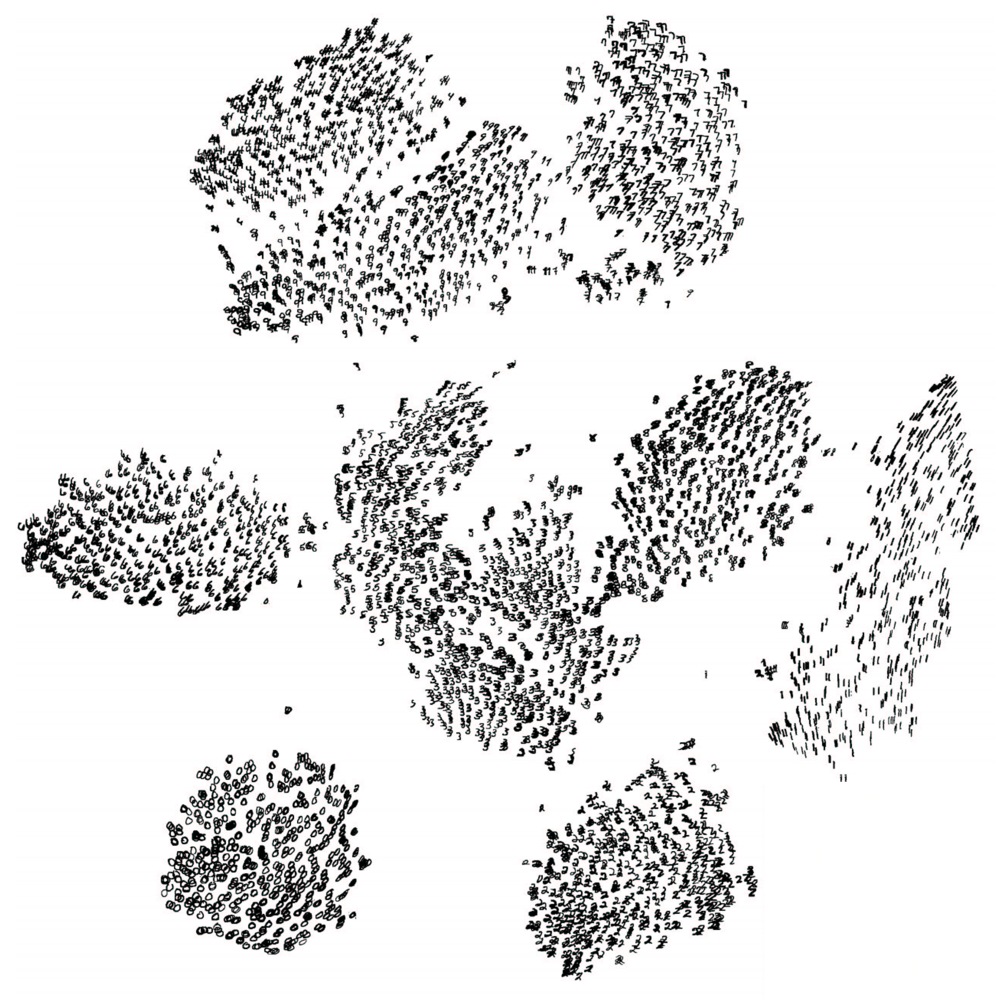

<h1 class="w-page">{{ typewriter.title }}</h1>
<h2 class="description w-page">{{ typewriter.description }}</h2>

<!--
<figure class="p-right-margin external">
  <a href="assets/mnist.png" target="blank">
    </img>
  </a>
  <figcaption style="bottom: 0px;">A t-SNE embedding of MNIST digits, from van der Maaten & Hinton.</figcaption>
</figure> -->

  {{> assets/playground.html}}

{{> byline.html}}

A popular method for exploring high-dimensional data is something called t-SNE, introduced by [van der Maaten and Hinton in 2008](https://lvdmaaten.github.io/publications/papers/JMLR_2008.pdf). The technique creates beautiful pictures, like the one at right showing the space of handwritten digits.
Although impressive, these images can be tempting to misread. The purpose of this note is to prevent some common misreadings.

We'll walk through a series of simple examples to illustrate what t-SNE diagrams can and cannot show. The t-SNE technique really is useful—but only if you know how to interpret it.

Before diving in: if you haven't encountered t-SNE before, here's what you need to know about the math behind it. The goal is to take a set of points in a high-dimensional space and find a faithful representation of those points in a lower-dimensional space, typically the 2D plane. The algorithm is non-linear and adapts to the underlying data, performing different transformations on different regions. Those differences can be a major source of confusion.

A second feature of t-SNE is a tuneable parameter, "perplexity," which says (loosely) how to balance attention between local and global aspects of your data. The perplexity value has a complex effect on the resulting pictures. The original paper says, _"The performance of SNE is fairly robust to changes in the perplexity, and typical values are between 5 and 50."_ But the true story is more nuanced than that. Getting the most from t-SNE may mean analyzing multiple plots with different perplexities.

That's not the end of the complications. The t-SNE algorithm doesn't always produce similar output on successive runs, for example, and there are additional hyperparameters related to the optimization process.

---

## 1. Those hyperparameters really matter

Let's start with the "hello world" of dimensionality reduction: a data set of two widely separated clusters.
Take two unit Gaussians in the plane, as shown in the lefthand diagram. For clarity, the two clusters are color coded. The diagrams at right show t-SNE plots for five values of perplexity.

  {{> assets/figures_01.html }}

With perplexity values in the range (5 - 50) suggested by van der Maaten & Hinton, the diagrams do show these clusters. You can also see that outside that range, things get a little weird. With perplexity 2, local variations dominate; at perplexity 100, the clusters merge into one blob.

Each of the plots above was made with 5,000 iterations with a learning rate (epsilon) of 10, and had reached a point of stability by step 5,000. How much of a difference do those values make? In our experience, the most important thing is to iterate until reaching a stable configuration.

<section class="w-page" id="figures-02">
  {{> assets/figures_02.html }}
</section>

The images above show five different runs at perplexity 30, the first four of which were stopped before stability. After 10, 20, 60, and 120 steps you can see layouts with seeming 1-dimensional and even pointlike images of the clusters. In general, if you see a t-SNE plot with strange "pinched" shapes, it's likely whoever made the image stopped too early.

Another natural question is whether different runs produce very different results. In this simple two-cluster example, and most of the others we discuss, multiple runs give the same global shape. Certain data sets, however, yield markedly different diagrams on different runs; we'll give an example of one of these later.

From now on, unless otherwise stated, we'll show results from 5,000 iterations; all the images you'll see reached a point of imperceptibly slow change. We'll keep showing a range of perplexities, however, since that seems to make a big difference in every case.

---

## 2. Cluster sizes in a t-SNE plot mean nothing

So far, so good. But what if the two clusters have different standard deviations, and so different sizes? (By size we mean bounding box measurements, not number of points.) Below are t-SNE plots for a mixture of Gaussians, where one is 10 times as dispersed as the other.

<section class="w-page" id="figures-03">
  {{> assets/figures_03.html }}
</section>

Surprisingly, the two clusters look about same size in the t-SNE plots.
What's going on? The t-SNE algorithm adapts its notion of "distance" to regional density variations in the data set. As a result, it naturally expands dense clusters, and contracts sparse ones, evening out cluster sizes. To be clear, this is a different effect than the run-of-the-mill fact that any dimensionality reduction technique will distort distances. (In fact in this example, all data was two-dimensional to begin with.) Rather, density equalization is a predictable fact about t-SNE. The bottom line is that you cannot compare sizes of clusters in a t-SNE plot.

It's interesting to look back at the MNIST visualization at the top of the page. All the clusters look roughly the same size. Maybe in reality they are, but the plot doesn't count as evidence.

---

## 3. Distances between clusters might not mean anything

What about distances _between_ clusters? The next diagrams show three Gaussians of 50 points each, one pair being 5 times as far apart as another pair.

<section class="w-page" id="figures-04">
  {{> assets/figures_04.html }}
</section>

At perplexity 50, the diagram gives a good sense of the global geometry. For lower perplexity values the clusters look equidistant. When the perplexity is 100, we see the global geometry fine, but one of the cluster appears, falsely, much smaller than the others.
Since perplexity 50 gave us a good picture in this example, can we can always set perplexity to 50 if we want to see global geometry?

Sadly, no. If we add more points to each cluster, the perplexity has to increase to compensate. Here are the t-SNE diagrams for three Gaussian clusters with 200 points each, instead of 50. Now none of the trial perplexity values gives a good result.

<section class="w-page" id="figures-05">
  {{> assets/figures_05.html }}
</section>

It's bad news that seeing global geometry requires fine-tuning perplexity. Real-world data would probably have multiple clusters with different numbers of elements. There may not be one perplexity value that will capture distances across all clusters—and sadly perplexity is a global parameter. Fixing this problem might be an interesting area for future research.

The basic message is that distances between well-separated clusters in a t-SNE plot may mean nothing.

---
## 4. Random noise doesn't always look random.

Knowing random data when you see it is a critical skill, but it takes time to build up the right intuitions. A tricky thing about t-SNE is that it throws a lot of existing intuition out the window.
The next diagrams show genuinely random data, 500 points drawn from a unit Gaussian distribution in 100 dimensions. The left image is a projection onto the first two coordinates.

<section class="w-page" id="figures-06">
  {{> assets/figures_06.html }}
</section>

The plot with perplexity 2 seems to show some dramatic clusters. If you were tuning perplexity to bring out structure in the data, you might think you'd hit the jackpot.

Of course, since we know the cloud of points was generated randomly, it has no statistically interesting clusters: those "clumps" aren't meaningful. If you look back at previous examples, low perplexity values often lead to this kind of distribution. Recognizing these clumps as random noise is an important part of reading t-SNE plots.

There's something else interesting, though, which may be a win for t-SNE. At first the perplexity 30 plot doesn't look like a Gaussian distribution at all: there's only a slight density difference across different regions of the cloud, and the points seem suspiciously evenly distributed. In fact, these features are saying useful things about high-dimensional normal distributions, which are very close to uniform distributions on a sphere: evenly distributed, with roughly equal spaces between points. In these respects, the t-SNE plot is more accurate than any linear projection could be.

---
## 5. You can see some shapes, sometimes

It's rare for data to be distributed in a perfectly uniform way. Let's take a look at an axis-aligned Gaussian distribution in 50 dimensions, where the standard deviation in coordinate i is 1/i. That is, we're looking at a long-ish ellipsoidal cloud of points.

<section class="w-page" id="figures-07">
  {{> assets/figures_07.html }}
</section>

You can see that for high enough perplexity values, the shapes comes through quite nicely. For low ones, we see local effects—and clumping—take center stage. But after seeing enough of these diagrams, you can start to recognize that's what's happening.
In the MNIST digits visualization shown at the beginning of this article, the cluster of handwritten "1"s is noticeably elongated. It's a well-separated from the rest of the data, so the shape probably isn't affected by other clusters. Chances are, it's genuinely elongated along one axis in the original high-dimensional space. (Looking closely at the image, can you tell what this axis represents?)

More extreme shapes also come through, but again only at the right perplexity. Here are two clusters of 50 points each in 2D, arranged in parallel lines with a bit of noise.

<section class="w-page" id="figures-08">
  {{> assets/figures_08.html }}
</section>

For a certain range of perplexity the long clusters look close to correct, which is reassuring.

Even in the best cases, though, there's a subtle distortion: the lines are slightly curved outwards in the t-SNE diagram. The reason is that, as usual, t-SNE tends to expand denser regions of data. Since the middles of the clusters have less empty space around them than the ends, the algorithm magnifies them.

---

## 6. For topology, you may need more than one plot

Sometimes you can read topological information off a t-SNE plot, but it typically requires views at multiple perplexities.
One of the simplest topological properties is containment. The plots below show two groups of 50 points in 50 dimensional space. Both are sampled from symmetric Gaussian distributions centered at the origin, but one is 50 times more tightly dispersed than the other. The "small" distribution is in effect contained in the large one.

<section class="w-page" id="figures-09">
  {{> assets/figures_09.html }}
</section>

The perplexity 30 view shows the basic topology correctly, but again t-SNE greatly exaggerates the size of the smaller group of points. At perplexity 50, there's a new phenomenon: the outer group becomes a circle, as the plot tries to depict the fact that all its are about the same distance from the inner group. If you looked at this image alone, it would be easy to misread these outer points as a one-dimensional structure.

What about more complicated types of topology? This may be a subject dearer to mathematicians than to practical data analysts, but interesting low-dimensional structures are occasionally found in the wild.

Consider points that trace a link or a knot in three dimensions. Once again, looking at multiple perplexity values gives the most complete picture. Low perplexity values give two completely separate loops; high ones show a kind of global connectivity.

<section class="w-page" id="figures-10">
  {{> assets/figures_10.html }}
</section>
<section class="w-page" id="figures-11">
  {{> assets/figures_11.html }}
</section>

The trefoil knot is an interesting example of how multiple runs affect the outcome of t-SNE. Below are five runs of the perplexity-2 view.

The algorithm settles on a circle twice. But in three of the runs it ends up with an arguably suboptimal solution, and these three configurations are quite different. (Using the dot color as a guide, you can see that the first and third runs are far from each other.)

<section class="w-page" id="figures-12">
  {{> assets/figures_12.html }}
</section>

Five runs at perplexity 50, however, give results that (up to symmetry) are visually identical. Evidently some problems are easier than others to optimize.

<section class="w-page" id="figures-13">
  {{> assets/figures_13.html }}
</section>

## Conclusion

There's a reason that t-SNE has become so popular: it's incredibly flexible, and can often find structure where other dimensionality-reduction algorithms cannot. Unfortunately, that very flexibility makes it tricky to interpret. Out of sight from the user, the algorithm makes all sorts of adjustments that tidy up its visualizations.
Don't let the hidden "magic" scare you away from the whole technique, though. The good news is that by studying how t-SNE behaves in simple cases, it's possible to develop an intuition for what's going on.
